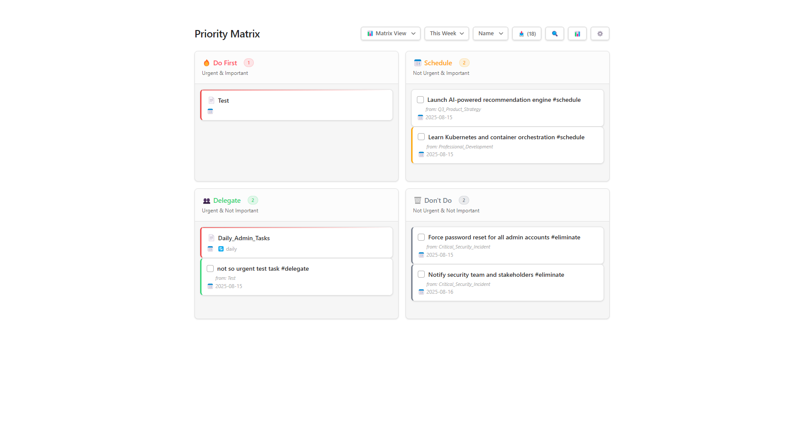
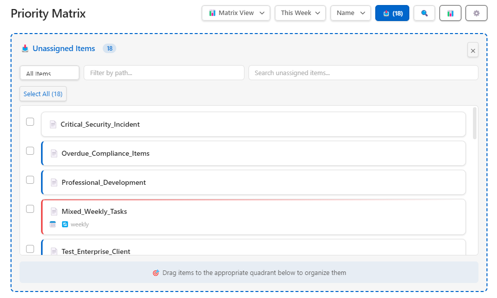
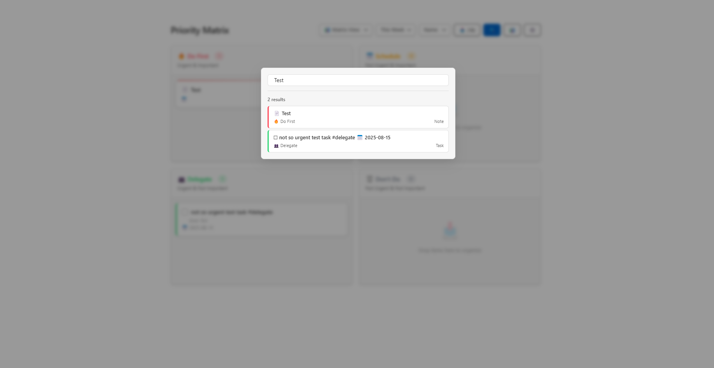
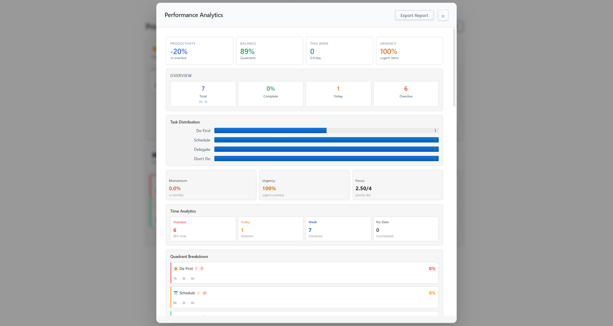
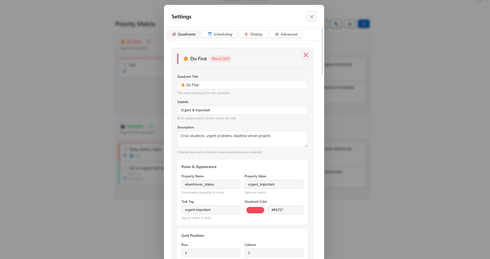

# Feel free to join our discord community where we build workflows, collaborate and share ideas: **[Discord Link](https://discord.gg/RTUTePmQt4)**

---

# Requirements:
1. must have datacore plugin installed 
(you can install via BRAT plugin. add this link: https://github.com/blacksmithgu/datacore)

# **Note:**
you can adjust the with through your css snippet file:
Appearance > CSS Snippets > add a `base.css` file here and enable

I would recommend pasting this to the `base.css` for more control over the width 


then adjust the note property to have this:
```
---
cssclasses:
  - max
  - hide-properties_reading
  - full-view
  - no-inline
---
```

---

# Obsidian Priority Matrix

A dynamic priority matrix component for Obsidian that helps organize notes and tasks using customizable quadrants.

## Features

- **Drag & Drop Organization** - Move notes and tasks between quadrants by dragging
- **Customizable Quadrants** - Configure any number of sections with custom colors, rules, and positions
- **Smart Filtering** - Filter by date (today, this week, overdue) or search across all items
- **Dual Organization** - Organize both notes (via frontmatter) and tasks (via tags)
- **Live Statistics** - Track productivity metrics, completion rates, and item distribution
- **Multiple Views** - Switch between matrix grid, list, and kanban board layouts

## How It Works

### Three-File Architecture
```
PriorityMatrix/
├── Priority Matrix.md       # Entry point - load this in Obsidian
├── PriorityMatrix.jsx       # React component logic
└── priority_matrix_data.json # Saves your configuration and settings
```

### Organization Rules

**Notes** are organized by frontmatter properties:
```yaml
---
eisenhower_status: urgent_important
due_date: 2024-12-25
---
```

**Tasks** are organized by tags:
```markdown
- [ ] Important task #urgent-important
- [ ] Delegate this #delegate
```

## Quick Start

1. Open `Priority Matrix.md` in Obsidian
2. Drag notes/tasks to organize them into quadrants
3. Configure quadrants in Settings (gear icon)
4. Use filters to focus on today's items or overdue tasks

## Requirements

- Obsidian with Datacore plugin installed
- React rendering enabled in Datacore

## Default Quadrants

- **🔥 Do First** - Urgent & Important
- **📅 Schedule** - Not Urgent & Important  
- **👥 Delegate** - Urgent & Not Important
- **🗑️ Don't Do** - Not Urgent & Not Important

Each quadrant can be customized or new ones can be added through the settings panel.

---

### Screenshots





